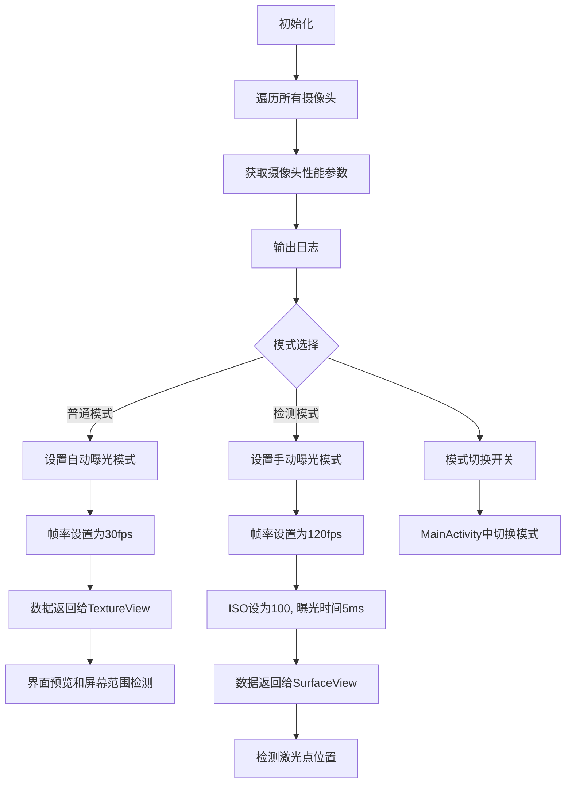
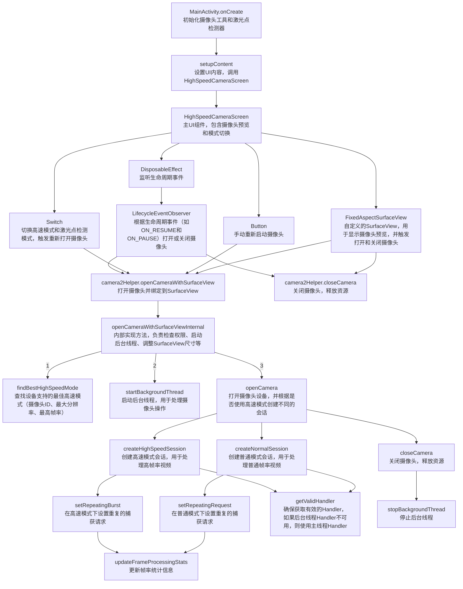

# Camera2Helper 优化说明

## 概述
`Camera2Helper` 类用于执行摄像头相关的操作，支持两种模式：普通模式和检测模式。普通模式用于摄像头图像预览和屏幕范围检测，检测模式用于高速帧率下的激光点检测。

## 功能需求
1. **初始化阶段**：
   - 遍历所有摄像头，获取每个摄像头的性能参数（如支持的帧率、分辨率、ISO范围等），并在日志中输出。

2. **普通模式**：
   - 使用自动曝光模式，帧率设置为30fps。
   - 将摄像头数据返回给 `TextureView`，用于界面预览和屏幕范围检测。

3. **检测模式**：
   - 使用高速帧模式，帧率设置为120fps。
   - 手动控制摄像头参数：ISO设为100，曝光时间设置为5ms。
   - 将摄像头数据返回给 `SurfaceView`，不显示在界面上，避免受到 `TextureView` 的帧率限制。
   - 获取的图像用于检测激光点位置。

4. **模式切换**：
   - 在 `MainActivity.kt` 中设置一个开关，用于切换普通模式和检测模式。

## 流程图

